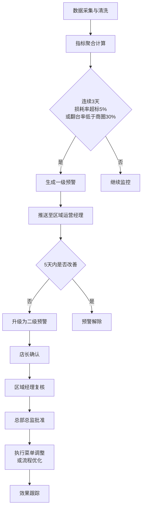
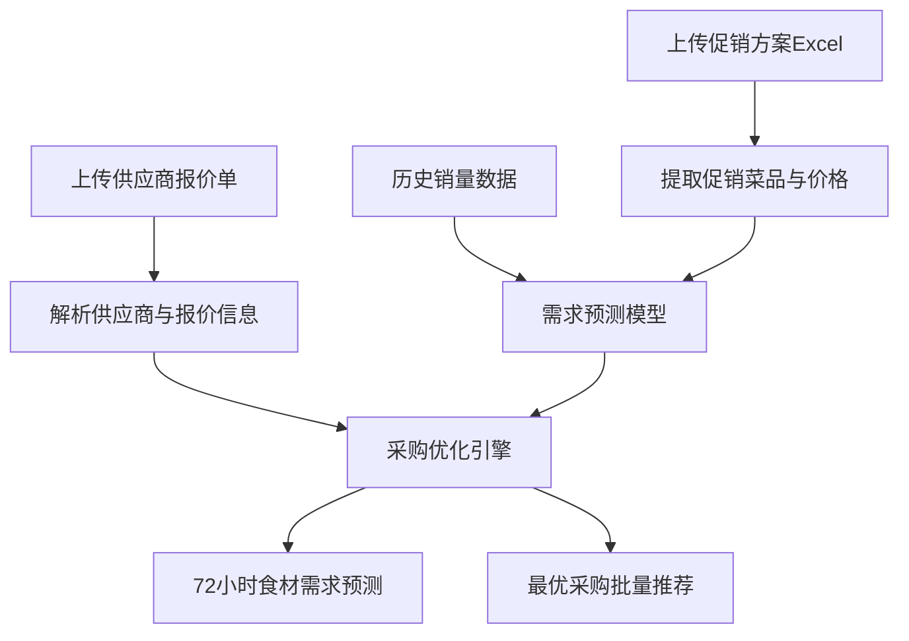

## 1. 产品概述

全国性连锁餐饮门店运营与食材损耗智能分析平台，面向连锁餐饮企业总部、区域和门店三级管理层，通过实时接入多源业务数据，提供经营指标监控、智能预警、需求预测和运营诊断等一体化分析能力，助力企业降本增效、优化运营决策。

- 目标用户：总部运营总监、区域运营经理、门店店长
- 核心价值：数据驱动的精细化运营管理，降低食材损耗，提升翻台效率

## 2. 核心功能

### 2.1 用户角色

| 角色 | 注册方式 | 核心权限 |
|------|----------|----------|
| 总部运营总监 | 系统分配 | 全国所有门店数据查看、二级预警审批、全国报表、菜单调整终审 |
| 区域运营经理 | 系统分配 | 所辖区域门店数据查看、一级预警推送接收、二级预警复核、区域报表 |
| 门店店长 | 系统分配 | 本门店数据查看、预警确认、库存/排班管理、门店报表 |

### 2.2 功能模块

1. **登录与权限中心**：三级权限控制、角色切换、数据范围隔离
2. **核心运营看板**：城市/品牌切换、翻台率热力图、菜品毛利排名、KPI概览
3. **门店详情下钻**：近7天菜品销量趋势、食材损耗分类占比、时段分析
4. **预警管理中心**：一级/二级预警列表、三级审批流程、预警处理记录
5. **智能采购预测**：节假日促销方案Excel上传、供应商报价单上传、72小时食材需求预测、最优采购批量推荐
6. **运营健康报告**：每周自动生成、同比环比分析、损耗原因分布、员工效率排名、优化建议

### 2.3 页面详情

| 页面名称 | 模块名称 | 功能描述 |
|----------|----------|----------|
| 登录页 | 登录表单 | 账号密码登录、角色身份验证、记住登录状态 |
| 核心看板 | 顶部导航 | 城市/品牌切换器、用户信息、消息通知、退出登录 |
| 核心看板 | KPI概览卡片 | 总营收、翻台率、毛利率、损耗率、人均产出五大核心指标及同比环比 |
| 核心看板 | 区域翻台率热力图 | 按省份/城市展示翻台率分布，颜色深浅代表指标高低 |
| 核心看板 | 菜品毛利排名 | Top10高毛利/低毛利菜品列表，支持按品类筛选 |
| 核心看板 | 门店列表 | 所辖门店列表，点击可下钻查看详情 |
| 门店详情 | 门店信息头 | 门店基本信息、当日核心指标、健康状态标签 |
| 门店详情 | 销量趋势图 | 各菜品近7天销量趋势曲线，支持多菜品对比 |
| 门店详情 | 损耗分类占比 | 饼图展示食材损耗分类（过期浪费、操作损耗、备料过多等） |
| 门店详情 | 时段分析 | 按时段展示翻台率、出餐量趋势 |
| 预警中心 | 预警列表 | 按级别/状态筛选的预警卡片，显示门店、指标、天数、建议措施 |
| 预警中心 | 审批流程 | 店长确认→区域经理复核→总部总监批准的三级审批流程 |
| 预警中心 | 预警历史 | 已处理预警记录及效果跟踪 |
| 采购预测 | 文件上传区 | 拖拽上传促销方案Excel和供应商报价单 |
| 采购预测 | 需求预测表 | 72小时分时段食材需求量预测 |
| 采购预测 | 采购推荐 | 基于报价单的最优供应商和采购批量推荐 |
| 健康报告 | 报告概览 | 本周运营健康评分、等级标签、关键发现 |
| 健康报告 | 同比环比 | 翻台率、毛利率、损耗率同比环比对比图表 |
| 健康报告 | 员工排名 | 后厨人均产出排名表 |
| 健康报告 | 优化建议 | AI生成的菜品结构优化和排班方案建议 |

## 3. 核心流程

### 3.1 预警与审批流程

### 3.2 采购预测流程

## 4. 用户界面设计

### 4.1 设计风格
- **主色调**：深邃石板蓝 `#1e3a5f`（专业、信赖），搭配暖橙色 `#e8823b`（警示、活力）
- **辅助色**：数据可视化使用蓝-绿-橙渐变配色方案
- **按钮风格**：圆角8px，轻微投影，悬浮时有背景色加深和上浮动画
- **字体**：展示字体使用"Noto Serif SC"（标题），正文字体使用"Noto Sans SC"（正文）
- **布局风格**：卡片式布局，信息分组清晰，左侧导航栏+顶部工具栏+主内容区
- **图标**：使用 Lucide React 线性图标，统一16px/20px尺寸

### 4.2 页面设计概览

| 页面名称 | 模块名称 | UI元素 |
|----------|----------|--------|
| 核心看板 | KPI卡片 | 渐变背景、大号数字、迷你趋势图、同比环比箭头指示 |
| 核心看板 | 热力图 | 交互式中国地图，省份/城市色块，悬浮Tooltip展示详情 |
| 核心看板 | 毛利排名 | 横向进度条排名，渐变色条，点击可查看菜品详情 |
| 门店详情 | 趋势曲线 | 平滑折线图，多条对比，渐变填充区域，数据点Tooltip |
| 门店详情 | 损耗占比 | 环形饼图，中间显示总量，图例可筛选 |
| 预警中心 | 预警卡片 | 彩色状态标签（红/黄/绿），倒计时指示，快捷操作按钮 |
| 预警中心 | 审批流程 | 时间线样式，审批节点状态指示，意见输入框 |
| 采购预测 | 上传区 | 虚线边框，拖拽高亮，文件列表预览 |
| 采购预测 | 推荐表 | 高亮最优推荐项，节省成本金额显示 |
| 健康报告 | 报告页面 | 杂志风格排版，大字号数据展示，分区卡片布局 |

### 4.3 响应式设计
- Desktop-first 设计，主布局最小支持1280px宽度
- 侧边栏在平板端可折叠为图标模式
- 图表区域支持最小宽度自适应，小屏下纵向堆叠

## 5. 核心计算指标定义

| 指标 | 计算公式 |
|------|----------|
| 翻台率 | 当日就餐总桌数 / 门店总桌数 |
| 毛利率 | (菜品销售额 - 食材成本) / 菜品销售额 × 100% |
| 食材损耗率 | 食材损耗金额 / 食材领用总金额 × 100% |
| 后厨人均产出 | 后厨出品总金额 / 后厨在岗人数 |
| 商圈翻台率均值 | 同商圈同品类门店翻台率加权平均值 |
