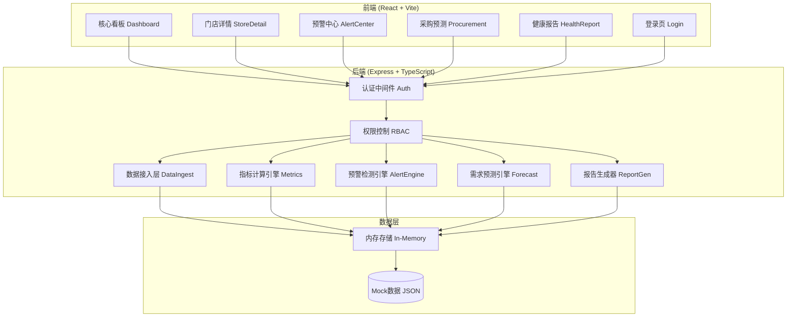

## 1. 架构设计



## 2. 技术选型说明

- **前端框架**: React@18 + TypeScript@5 + Vite@5
- **状态管理**: Zustand@4（轻量级、高性能）
- **UI样式**: TailwindCSS@3
- **图表可视化**: Recharts@2（React原生图表库）
- **路由**: React Router DOM@6
- **图标**: Lucide React
- **Excel解析**: SheetJS (xlsx)
- **后端**: Express@4 + TypeScript@5
- **数据层**: Mock JSON 数据 + 内存存储（演示用）

## 3. 路由定义

| 路由路径 | 页面组件 | 权限角色 | 说明 |
|----------|----------|----------|------|
| `/login` | LoginPage | 公开 | 登录页面 |
| `/dashboard` | DashboardPage | 总部/区域/门店 | 核心运营看板 |
| `/store/:id` | StoreDetailPage | 总部/区域/门店 | 门店详情下钻 |
| `/alerts` | AlertsPage | 总部/区域/门店 | 预警管理中心 |
| `/procurement` | ProcurementPage | 总部/区域 | 智能采购预测 |
| `/report` | ReportPage | 总部/区域/门店 | 每周健康诊断报告 |
| `/settings` | SettingsPage | 总部 | 系统设置 |

## 4. 前端API类型定义

```typescript
// 角色类型
export type UserRole = 'headquarters' | 'region' | 'store';

// 用户信息
export interface User {
  id: string;
  name: string;
  role: UserRole;
  regionId?: string;
  storeId?: string;
  avatar?: string;
}

// 门店信息
export interface Store {
  id: string;
  name: string;
  city: string;
  province: string;
  brand: string;
  address: string;
  totalTables: number;
  staffCount: number;
  regionId: string;
}

// KPI指标
export interface KPIData {
  totalRevenue: number;
  revenueYoY: number;
  revenueMoM: number;
  turnoverRate: number;
  turnoverRateYoY: number;
  turnoverRateMoM: number;
  grossMargin: number;
  grossMarginYoY: number;
  grossMarginMoM: number;
  wastageRate: number;
  wastageRateYoY: number;
  wastageRateMoM: number;
  outputPerCapita: number;
  outputYoY: number;
  outputMoM: number;
}

// 区域热力图数据
export interface RegionHeatmapData {
  province: string;
  city: string;
  turnoverRate: number;
  storeCount: number;
}

// 菜品毛利数据
export interface DishMargin {
  id: string;
  name: string;
  category: string;
  salesVolume: number;
  revenue: number;
  cost: number;
  grossMargin: number;
}

// 销量趋势数据
export interface SalesTrend {
  date: string;
  dishes: {
    dishId: string;
    dishName: string;
    quantity: number;
    revenue: number;
  }[];
}

// 食材损耗分类
export interface WastageCategory {
  category: 'expired' | 'operation' | 'over_prep' | 'quality' | 'other';
  label: string;
  amount: number;
  percentage: number;
}

// 预警信息
export type AlertLevel = 'level1' | 'level2';
export type AlertStatus = 'pending' | 'confirmed' | 'reviewed' | 'approved' | 'resolved' | 'expired';
export type AlertType = 'wastage' | 'turnover';

export interface Alert {
  id: string;
  storeId: string;
  storeName: string;
  type: AlertType;
  level: AlertLevel;
  status: AlertStatus;
  metricValue: number;
  threshold: number;
  consecutiveDays: number;
  createdAt: string;
  suggestion: string;
  approvalFlow?: ApprovalFlow;
}

// 审批流程
export interface ApprovalFlow {
  storeManagerConfirm?: ApprovalStep;
  regionManagerReview?: ApprovalStep;
  hqDirectorApprove?: ApprovalStep;
}

export interface ApprovalStep {
  userId: string;
  userName: string;
  status: 'pending' | 'approved' | 'rejected';
  comment?: string;
  timestamp?: string;
}

// 采购预测
export interface ForecastItem {
  ingredientId: string;
  ingredientName: string;
  unit: string;
  hourlyDemand: number[]; // 72小时数据
  totalDemand: number;
  suggestedOrder: number;
}

export interface SupplierQuote {
  supplierId: string;
  supplierName: string;
  ingredientId: string;
  ingredientName: string;
  price: number;
  minOrder: number;
  deliveryTime: string;
}

// 健康报告
export interface HealthReport {
  weekStart: string;
  weekEnd: string;
  healthScore: number;
  healthLevel: 'excellent' | 'good' | 'average' | 'poor';
  metricsComparison: {
    metric: string;
    currentWeek: number;
    lastWeek: number;
    samePeriodLastYear: number;
  }[];
  wastageReasonDistribution: {
    reason: string;
    percentage: number;
  }[];
  staffRanking: {
    staffId: string;
    staffName: string;
    storeName: string;
    output: number;
    rank: number;
  }[];
  suggestions: string[];
}
```

## 5. 后端API定义

| 方法 | 路径 | 说明 | 权限 |
|------|------|------|------|
| POST | `/api/auth/login` | 用户登录 | 公开 |
| GET | `/api/auth/profile` | 获取当前用户信息 | 全部 |
| GET | `/api/stores` | 获取门店列表 | 全部（按数据范围） |
| GET | `/api/stores/:id` | 获取门店详情 | 全部（按数据范围） |
| GET | `/api/kpi/summary` | 获取KPI汇总数据 | 全部（按数据范围） |
| GET | `/api/kpi/heatmap` | 获取区域热力图数据 | 总部/区域 |
| GET | `/api/dishes/margin-ranking` | 获取菜品毛利排名 | 全部（按数据范围） |
| GET | `/api/stores/:id/sales-trend` | 获取门店销量趋势 | 全部（按数据范围） |
| GET | `/api/stores/:id/wastage-category` | 获取损耗分类占比 | 全部（按数据范围） |
| GET | `/api/alerts` | 获取预警列表 | 全部（按数据范围） |
| POST | `/api/alerts/:id/confirm` | 店长确认预警 | 门店 |
| POST | `/api/alerts/:id/review` | 区域经理复核 | 区域 |
| POST | `/api/alerts/:id/approve` | 总部总监批准 | 总部 |
| POST | `/api/alerts/:id/resolve` | 标记预警已解决 | 区域/总部 |
| POST | `/api/procurement/upload-promotion` | 上传促销方案Excel | 总部/区域 |
| POST | `/api/procurement/upload-quote` | 上传供应商报价单 | 总部/区域 |
| GET | `/api/procurement/forecast` | 获取需求预测 | 总部/区域 |
| GET | `/api/report/weekly` | 获取每周健康报告 | 全部（按数据范围） |

## 6. 项目目录结构

```
├── src/                          # 前端源码
│   ├── components/               # 通用组件
│   │   ├── layout/               # 布局组件（Sidebar、Header）
│   │   ├── charts/               # 图表组件（热力图、折线图、饼图等）
│   │   ├── cards/                # 卡片组件（KPI卡片、预警卡片等）
│   │   └── common/               # 通用UI（按钮、输入框、表格等）
│   ├── pages/                    # 页面组件
│   │   ├── Login.tsx
│   │   ├── Dashboard.tsx
│   │   ├── StoreDetail.tsx
│   │   ├── Alerts.tsx
│   │   ├── Procurement.tsx
│   │   └── Report.tsx
│   ├── hooks/                    # 自定义Hooks
│   ├── store/                    # Zustand状态管理
│   ├── utils/                    # 工具函数
│   ├── types/                    # TypeScript类型定义
│   ├── services/                 # API请求服务
│   └── App.tsx
├── api/                          # 后端源码
│   ├── routes/                   # 路由定义
│   ├── controllers/              # 控制器
│   ├── services/                 # 业务逻辑服务
│   ├── middleware/               # 中间件
│   ├── mock/                     # Mock数据
│   └── index.ts                  # 服务入口
├── shared/                       # 前后端共享类型
├── public/                       # 静态资源
├── vite.config.ts
├── tailwind.config.js
├── tsconfig.json
└── package.json
```

## 7. 设计系统

### 7.1 颜色令牌 (Tailwind config)

```javascript
colors: {
  primary: {
    50:  '#f0f4f8',
    100: '#d9e2ec',
    200: '#bcccdc',
    300: '#9fb3c8',
    400: '#829ab1',
    500: '#1e3a5f', // 主色 - 深邃石板蓝
    600: '#162d4a',
    700: '#0f1f33',
    800: '#091321',
    900: '#04070d',
  },
  accent: {
    50:  '#fff5ec',
    100: '#ffe6cc',
    200: '#ffc899',
    300: '#ffab66',
    400: '#f29240',
    500: '#e8823b', // 辅助色 - 暖橙色
    600: '#c96a2a',
    700: '#a85520',
    800: '#87411a',
    900: '#662f12',
  },
  success: '#16a34a',
  warning: '#f59e0b',
  danger:  '#dc2626',
  info:    '#0ea5e9',
}
```

### 7.2 字体层级

- Display/大标题: `text-3xl font-bold` (Noto Serif SC)
- H1/页面标题: `text-2xl font-bold` (Noto Serif SC)
- H2/区块标题: `text-xl font-semibold` (Noto Sans SC)
- H3/卡片标题: `text-lg font-semibold` (Noto Sans SC)
- Body/正文: `text-sm` (Noto Sans SC)
- Caption/辅助文字: `text-xs` (Noto Sans SC)
